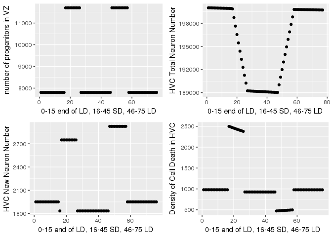

HVC Model
================
Nivretta Thatra
16/05/2017

``` r
library(ggplot2)
library(gridExtra)
```

### Initialize variables and vectors

``` r
#time interval of one day
dt = 1
#total of 75 days
tFinal = 75

#list of numeric t values
t = seq(0, tFinal, by= dt)

b = c(1:length(t)) #list of "breeding season" values
progenitors = c(1:length(t)) #new stem cells & neural progenitor cells in VZ (express nestin)
migrators = c(1:length(t)) #new daughters of neural progenitor cells that have begun to migrate to HVC (express doublecortin)
newNeuronHVC = c(1:length(t)) #proportion of migrators that successfully get to HVC (express NeuN)
neuronNumHVC = seq(200000, (tFinal+200000), by= dt) #total number of neurons in HVC, with baseline 200,000
apoptosisHVC = c(1:length(t)) #death in HVC
proliferationVZ = c(1:length(t)) #proliferation in VZ
migrationSuccess = c(1:length(t))
apoptosis = c(1:length(t))
preserveHVC = c(1:length(t))

minVZ = 7800  #minimum number of newly proliferated cells in VZ during LD, taken from Reg I data
migrationDuration = 10  # duration of migration in days
incorporationSuccess = 0.5  #success of migrated neurons' incorporation

##unused variables but useful to know
#changeDuration = 2  #days it takes to change from stem cell to migrator that expresses doublecortin
```

``` r
for (n in 1:(length(t))){ 
    
    #assign 'breeding seasons' to time points 
    if (t[n] < 15) { 
        b[n] = 1 
    } else if (t[n] >=15 & t[n] <= 45) { 
        b[n] = 0 
    } else {
        b[n] = 1 } 

    #days 16-25 and 46-56 are 'plastic state' days, ie when the neural circuitry is transitioning between seasons
    if (b[n] == 0 & t[n] >=16 & t[n] <=25) {
        proliferationVZ[n] = 1.5  #rate of VZ prolif during LD --> SD
    } else if (b[n] == 1 & t[n] >=46 & t[n] <=56) {
        proliferationVZ[n] = 1.5  #rate of VZ prolif during SD --> LD
    } else {
        proliferationVZ[n] = 1 } #rate of VZ prolif during stable state
    
    
    progenitors[n] = minVZ * proliferationVZ[n] 

    #if we hyopthesize that the number of progenitors' daughters that migrate out of VZ is affected by breeding season, we can test that here
    if (b[n] == 1) { 
        migrators[n] = (progenitors[n] * 0.5)  #neural progenitor daughters that migrate out during breeding condition
    } else {
        migrators[n] = (progenitors[n] * 0.5) }
    
    #if we hypothesize that some migrating progenitor daughters don't make it to HVC as a function of breeding season, we can test that here 
    if (b[n] == 1) { 
        migrationSuccess[n] = 0.5  
    } else {
        migrationSuccess[n] = 0.47}
    
    newNeuronHVC[n] = migrators[n] * migrationSuccess[n]  

    #Effect of breeding season on apoptosis
    if (b[n] == 0 & t[n] >=16 & t[n] <=25) {
        apoptosisHVC[n] = .0125  #apoptosis rate during LD-->SD   
    } else if (b[n] == 1 & t[n] >=46 & t[n] <=56) {
        #apoptosis rate during SD-->LD, less due to effect of testosterone
        apoptosisHVC[n] = .0025  
    } else {
        apoptosisHVC[n] = .0049}  #apoptosis rate during stable state
    
    
    #if b[n] == 0 && t[n] >=16 && t[n] <=25
    #    preserveHVC[n] = 0  #T does not save neurons from death during LD-->SD   
    #elseif b[n] == 1 && t[n] >=46 && t[n] <=56
    #    preserveHVC[n] = .01  #T "saves" mature neurons in HVC from death during SD --> LD 
    #else
   #     preserveHVC[n] = 0  #during stable state
    
    neuronNumHVC[n+1] = neuronNumHVC[n] + (newNeuronHVC[n] * incorporationSuccess) - (apoptosisHVC[n] * neuronNumHVC[n]) 
    
    apoptosis[n] = apoptosisHVC[n] * neuronNumHVC[n] 
}
```

### Plotting

``` r
p1 <- qplot(seq_along(progenitors), progenitors) + xlab("0-15 end of LD, 16-45 SD, 46-75 LD") + ylab("number of progenitors in VZ")

p2 <- qplot(seq_along(newNeuronHVC), newNeuronHVC) + xlab("0-15 end of LD, 16-45 SD, 46-75 LD") + ylab("HVC New Neuron Number")

p3 <- qplot(seq_along(neuronNumHVC), neuronNumHVC) + xlab("0-15 end of LD, 16-45 SD, 46-75 LD") + ylab("HVC Total Neuron Number")

p4 <- qplot(seq_along(apoptosis), apoptosis) + xlab("0-15 end of LD, 16-45 SD, 46-75 LD") + ylab("Density of Cell Death in HVC")


source("multiplot.R")
graph <- multiplot(p1, p2, p3, p4, cols=2)
```


